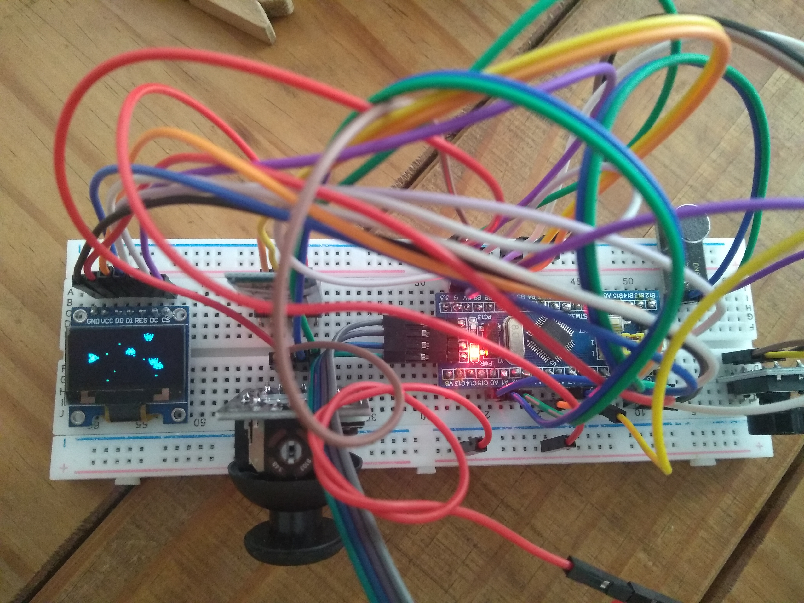

# Micro-game

## Learning Rust, embedded devices (stm32), game development and having fun and at the same time.

Gameplay: https://www.youtube.com/watch?v=BnHSmtdbuVA

watch and build:
cargo watch -cx 'build --release'

watch + upload :
cargo watch -cx 'flash --chip stm32f103C8 --release'

